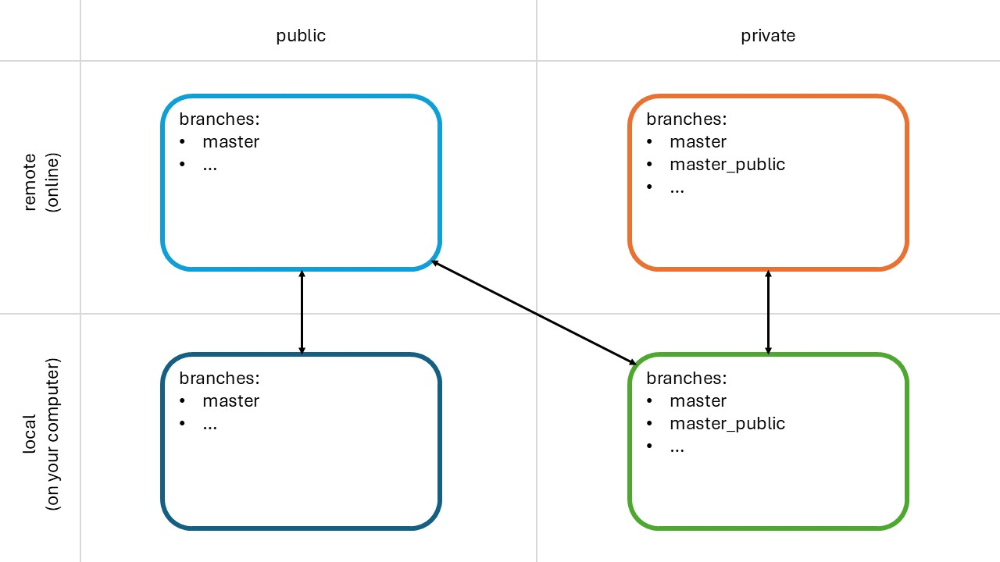
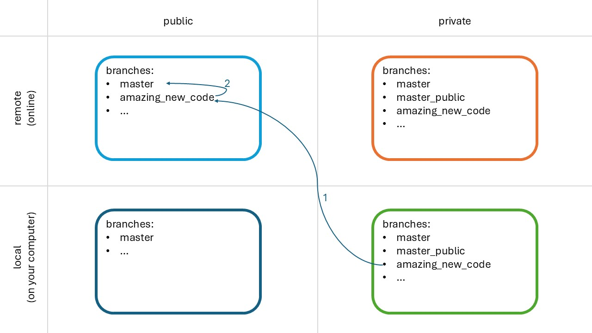

The [PredSim repository](https://github.com/KULeuvenNeuromechanics/PredSim) is public and Github does not allow the creation of private forks for public repositories.
If you want to have a private version that can still fetch updates from the public repository, you can use this workaround.

## Creating the private repository

Workflow below is adapted from [here](https://gist.github.com/0xjac/85097472043b697ab57ba1b1c7530274).

The correct way of creating a private frok by duplicating the repo is documented [here](https://help.github.com/articles/duplicating-a-repository/).

For this repository the Git Bash commands are:

 1. Create a bare clone of the repository.
    (This is temporary and will be removed so just do it wherever.)
    ```bash
    git clone --bare https://github.com/KULeuvenNeuromechanics/PredSim.git
    ```

 2. [Create a new private repository on Github](https://help.github.com/articles/creating-a-new-repository/) and name it `PredSim_private`.

 3. Mirror-push your bare clone to your new `PredSim_private` repository.
    > Replace `<your_username>` with your actual Github username in the url below.
    
    ```bash
    cd PredSim.git
    git push --mirror https://github.com/<your_username>/PredSim_private.git
    ```

 4. Remove the temporary local repository you created in step 1.
    ```bash
    cd ..
    rm -rf PredSim.git
    ```
    
 5. You can now clone your `PredSim_private` repository on your machine (for example in the `C:/GBW_MyPrograms` folder).
    ```bash
    cd C:/GBW_MyPrograms
    git clone https://github.com/<your_username>/PredSim_private.git
    ```

 6. If you want, add the original repo as remote to fetch (potential) future changes. This creates the diagonal link in Figure 1.
    ```bash
    cd PredSim_private
    git remote add upstream https://github.com/KULeuvenNeuromechanics/PredSim.git
    ```
    You can list all your remotes with `git remote -v`. You should see:
    ```
    origin	https://github.com/<your_username>/PredSim_private.git (fetch)
    origin	https://github.com/<your_username>/PredSim_private.git (push)
    upstream	https://github.com/KULeuvenNeuromechanics/PredSim_private.git (fetch)
    upstream	https://github.com/KULeuvenNeuromechanics/PredSim_private.git (push)
    ```
   

 7. If you use GitHub Desktop, you have to add PredSim_private to the list of repositories:
   - Current repository
   - Add
   - Add existing repository...
   - Local path: `C:/GBW_MyPrograms/PredSim_private` (Use the same folder you selected in step 5.)
   - Add repository
   
 8. Your fork might have a different default branch. Set `master` or your own branch as default.

<p align="center">

</p>

> Figure 1. Different types of repositories, and how they can be linked.

After completing these steps, you have created 2 linked PredSim repositories: 
- private remote (orange, top right), to which you can invite others to collaborate
- private local (green, bottom right)

The public local repository (dark blue, bottom left) can be obtained by simply cloning the [public remote repository](https://github.com/KULeuvenNeuromechanics/PredSim).


## Updating PredSim_private based on the public PredSim repository


<p align="center">

</p>

> Figure 2. Updating PredSim_private based on the public PredSim repository.
The numbered arrows illustrate the steps described below.

### Automated

In File Explorer, go to the directory with the private PredSim code, e.g.  `C:\GBW_MyPrograms\PredSim_private`
In `.\VariousFunctions`, run [update_from_public.bat](../VariousFunctions/update_from_public.bat) (double-click in File Explorer).

### Manual

0. In File Explorer, go to the directory with the private PredSim code, e.g. `C:\GBW_MyPrograms\PredSim_private`

   Right-click and choose *Git Bash here*. You might need to right-click > more > Git Bash here on windows 11.
This will open the git command window.

In this command window, run the following commands:

1. Download the changes made to the online public PredSim repository (= *upstream*) to your computer.

    `git fetch upstream`

2. In the private repository on your computer, make *master_public* the active branch.

    `git checkout master_public`
    
    If this branch does not yet exist, create the branch locally

    `git checkout -b master_public`

    and add it to the online repo

    `git push -u origin master_public`

3. Copy the master branch of the public PredSim repository on your computer into the branch selected in step 2.

    `git merge upstream/master -m "update from public master"`

    In some cases it is not necessary to include a commit message, and a shorter command can be used:

    `git merge upstream/master`

4. Update the branch *master_public* in the online repository with the local changes from *master_public*

    `git push origin`

5. Create a pull request from *master_public* into *master* (via github desktop, or the github website)

6. After the pull request has been approved and merged, use *fetch origin* and *pull origin* to get your local repository up to date


## Contribute from PredSim_private to the public PredSim repository

If you have developer access to the public PredSim repository, creating a pull request with code from a private repository is [relatively easy](#predsim-dev). Otherwise, [you need a few extra steps](#general-contributer).

### PredSim dev


<p align="center">

</p>

> Figure 3. Contribute from PredSim_private to the public PredSim repository (developer access to PredSim).
The numbered arrows illustrate the steps described below.

0. In File Explorer, go to the directory with the private PredSim code, e.g. `C:\GBW_MyPrograms\PredSim_private`

   Right-click and choose *Git Bash here*. You might need to right-click > more > Git Bash here on windows 11.
This will open the git command window.

1. Copy the branch with code you want to contribute from the private to the public PredSim repository.

   `git push upstream amazing_new_code`

   If you want your public branch to have a different name, do this instead:

      1.1. Create a new branch *amazing_new_code* in the public PredSim repository

      1.2. `git push upstream tmp_3-final2:amazing_new_code`


2. Create a pull request from *amazing_new_code* into *master* (via github desktop, or the github website)

### General contributer

<p align="center">

</p>

> Figure 4. Contribute from PredSim_private to the public PredSim repository (no developer access to PredSim).
The numbered arrows illustrate the steps described below.

If you already have a (public) fork of PredSim, skip steps 1 and 2.

0. In File Explorer, go to the directory with the private PredSim code, e.g. `C:\GBW_MyPrograms\PredSim_private`

   Right-click and choose *Git Bash here*. You might need to right-click > more > Git Bash here on windows 11.
This will open the git command window.

1. [Fork the PredSim repository](https://github.com/KULeuvenNeuromechanics/PredSim/fork)

2. In your local private repository: add the new fork as a remote

   `git remote add fork https://github.com/<your_username>/PredSim.git`

3. Copy the branch with code you want to contribute from the private repository to your public fork.

   `git push fork amazing_new_code`

   If you want your public branch to have a different name, do this instead:

      3.1. Create a new branch *amazing_new_code* in your public fork

      3.2. `git push fork tmp_3-final2:amazing_new_code`

4. Create a pull request from *amazing_new_code* into *master* (via github desktop, or the github website)


